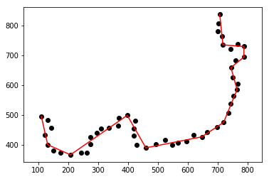

# Douglas-Peucker Line Generalisation Algorithm
Implementing the Douglas-Peucker line generalisation algorithm in python3

## Content
- *Driver.py* is the driver starting the program.
- */img* folder shows ouput images

Wiggle8.txt generalised with a threshold of 50.0; The black points represent the original point, the red line represent the generalised polyline.

Wiggle8.txt generalised with a threshold of 30.0; The black points represent the original point, the red line represent the generalised polyline.
